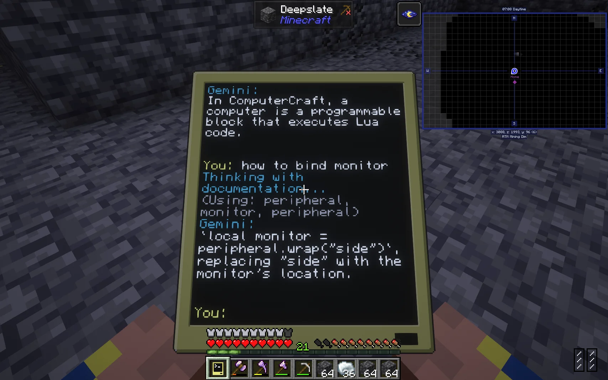

# TurtleAI
Welcome to my AI integration project for Minecraft! 

I only started playing the [Computer Craft: Tweaked](https://tweaked.cc/) mod a couple weeks ago -- it lets you run Lua code in Minecraft on little computers and entities called Turtles -- I've definitely been hyperfocusing on it a little bit. I'm actually playing in survival mode so I haven't even unlocked most of the mod yet, including GPS lmao. Our server is using [AllTheMods9](https://www.curseforge.com/minecraft/modpacks/all-the-mods-9).

Anyway, this project is all about piping LLM APIs into Minecraft so you can use AI to answer questions about documentation, translate natural language into turtle mining code, power fully independent NPCs and computer systems... Right now I've got working integrations for Gemini and Ollama chatbots. I'm just gonna poop this code into the public sphere before I get distracted. Having other people complain about my code will motivate me to make it better. Sorry in advance.

## Getting Started
Download and run [this client setup script](https://github.com/gotoundo/TurtleAI/blob/main/download_turtle_ai_client.lua) on your in-game Computer to download the Gemini chatbot with documentation, and the client for controlling turtles. Then download and run [this turtle server setup script](https://github.com/gotoundo/TurtleAI/blob/main/download_turtle_ai_server.lua) on a turtle you want to control. The standalone ollama chatbot defaults to [qwen](https://ollama.com/library/qwen2.5) but you can edit the script try whatever local model you'd like to use. You'll want to get a free Gemini key from [Google AI Studio](https://ai.google.dev/gemini-api/docs/api-key). Currently only the Gemini chatbot has access the computercraft documentation, and is faster and is easier to use on multiplayer servers.

I think the [gemini_turtle.lua](https://github.com/gotoundo/TurtleAI/blob/main/gemini_turtle.lua) script is the most interesting right now as it lets you talk to the turtle in natural language and it will execute custom Lua code to drive itself around and do stuff. My main focus now is cleaning up the prompt engineering so it can understand ComputerCraft code better. I've included a simple_mining script the turtle can call with different dimensions - a demonstration of agentic tool calling. I also want to make gemini_turtle run from a remote Advanced pocket computer because that's obviously cooler. I strongly recommend you use a secure pocket computer for this as the API key(s) are saved in plaintext in the computer/turtle's settings. Don't use this code on a public server or someone can probably steal your API key (this is bad).

## Let's make Skynet in Minecraft lmao
Anyways, I'd love to collaborate with you on this project. Please use the [discussion tab](https://github.com/gotoundo/TurtleAI/discussions), make pull requests, etc. Even if you don't know how to code I'd love to know what types of scripts you're using so I can check them out as a reference. Again, I only started in ComputerCraft a couple weeks ago and this mod apparently has like a decade of history. If you're a more advanced coder and down to clown, let's start dividing up work ;)
